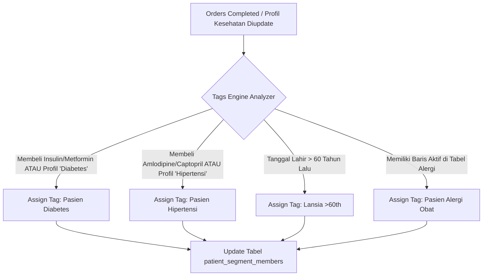

# PRODUCT REQUIREMENT DOCUMENT (PRD)
## MODUL ADVANCED CRM, PROGRAM LOYALITAS POIN, SEGMENTASI PELANGGAN OTOMATIS, DAN CRUD MANAJEMEN PRODUK ADMIN

| Dokumen Info | Detail |
| --- | --- |
| **Proyek** | E-Pharmacy Apotek Online (SaaS-based Healthtech) |
| **Backend** | Supabase (PostgreSQL) |
| **Frontend** | ReactJS (Vite, TailwindCSS / Vanilla CSS) |
| **Penyusun** | Senior Product Manager & Solutions Architect |
| **Status** | Siap Implementasi (Ready for Dev & UI/UX Design) |
| **Target Dampak** | Peningkatan Retention Rate sebesar 30% |

---

## 1. Project Overview & Business Objectives

### 1.1 Latar Belakang & Masalah
Berdasarkan data operasional apotek online existing, tingkat pembelian kembali (*repeat order*) oleh pelanggan masih rendah. Riwayat kesehatan dan data pembelian obat rutin pasien (misalnya pasien penyakit kronis seperti Diabetes dan Hipertensi) belum dikelompokkan secara otomatis. Akibatnya, tim marketing kesulitan memberikan program loyalitas, promo, dan edukasi kesehatan yang personal dan tepat sasaran. 

Di sisi operasional, tim Admin belum memiliki antarmuka (UI) manajemen katalog obat yang efisien untuk melakukan pembaruan stok secara *real-time*, memperbarui kategori obat resep vs non-resep, dan mengontrol status aktif obat tanpa mengganggu integritas transaksi terdahulu.

### 1.2 Tujuan Bisnis (Objectives)
1. **Retention & Repeat Order**: Meningkatkan Retention Rate pelanggan sebesar 30% dalam waktu 6 bulan setelah perilisan fitur.
2. **Data-Driven Personalization**: Memanfaatkan data riwayat kesehatan, alergi, dan resep untuk melakukan pengelompokan pelanggan otomatis (*Tags Engine*).
3. **Personalized Consultations**: Mengintegrasikan data profil 360° pasien langsung ke panel samping (*side-panel*) obrolan Apoteker pada fitur Live Chat.
4. **Operational Efficiency**: Menyediakan modul CRUD produk admin yang efisien untuk memperbarui persediaan obat secara *real-time*.

### 1.3 Metrik Keberhasilan (Key Performance Indicators - KPI)
- **Customer Retention Rate (CRR)**: Meningkat minimal 30% dibanding kuartal sebelumnya.
- **Point Redemption Rate (PRR)**: Minimal 25% dari total member aktif melakukan penukaran poin dalam transaksi mereka.
- **Consultation Quality & Engagement**: Kecepatan penanganan apoteker dalam memberikan saran medis yang akurat meningkat karena adanya data riwayat kesehatan instan (Target: rating kepuasan chat > 4.7/5.0).
- **Admin Catalog Update Speed**: Rata-rata waktu pembaruan stok obat oleh Admin turun dari 5 menit menjadi di bawah 1 menit per produk.

---

## 2. User Stories & Acceptance Criteria

Berikut adalah daftar kebutuhan pengguna yang dirancang dalam format terstruktur untuk memandu tim desainer UI/UX serta developer frontend/backend:

| ID Story | Persona | User Story | Acceptance Criteria (Given-When-Then) |
| :--- | :--- | :--- | :--- |
| **US-001** | Pelanggan | **As a** Pelanggan, **I want to** melihat saldo poin loyalitas saya di halaman profil dan checkout, **So that** saya mengetahui akumulasi reward yang saya miliki untuk potongan belanja. | **Given** Pelanggan telah masuk (*logged in*) dan memiliki saldo 5.000 poin. **When** Pelanggan mengunjungi halaman "Dashboard Member" atau "Halaman Checkout". **Then** Sistem harus menampilkan saldo poin dengan konversi Rupiah yang jelas (misal: "5.000 Poin = Rp 50.000"). |
| **US-002** | Pelanggan | **As a** Pelanggan, **I want to** menggunakan poin loyalitas saya saat transaksi checkout, **So that** saya dapat memotong biaya belanja obat saya secara langsung. | **Given** Pelanggan berada di halaman Checkout dengan subtotal belanja Rp 100.000. **When** Pelanggan mengaktifkan opsi "Gunakan Poin" dan memasukkan nominal 500 poin (setara Rp 5.000). **Then** Sistem memvalidasi poin tersebut via RPC Supabase `redeem_loyalty_points`, mengurangi subtotal belanja menjadi Rp 95.000, dan memperbarui ringkasan pembayaran secara dinamis. |
| **US-003** | Apoteker | **As a** Apoteker, **I want to** melihat riwayat medis, alergi, dan tag segmen pasien langsung di side-panel Live Chat, **So that** saya dapat memberikan saran obat yang aman dan edukasi yang personal tanpa perlu mencari data secara manual. | **Given** Apoteker sedang melayani Live Chat pasien bernama "Budi Santoso". **When** Obrolan aktif dibuka. **Then** Side-panel kanan otomatis memuat informasi dari view database `patient_360_summary` (Kondisi Medis: Diabetes Tipe 2, Alergi: Amoxicillin [Severe], Tag: "Pasien Diabetes"). |
| **US-004** | Admin Marketing | **As an** Admin Marketing, **I want to** membuat kode promo baru dan menargetkannya ke segmen pasien tertentu, **So that** saya bisa mendistribusikan promo khusus (misal diskon obat hipertensi) yang tepat sasaran. | **Given** Admin masuk ke dashboard promosi. **When** Admin membuat promo bertipe persentase "DIABETES20" dan mengaitkannya ke segmen target `Pasien Diabetes`. **Then** Promo berhasil disimpan di tabel `promos` dengan RLS yang aman, dan sistem siap membatasi penggunaan kode tersebut hanya untuk member dengan segmen yang cocok. |
| **US-005** | Admin Gudang / Apotek | **As an** Admin Gudang, **I want to** melakukan tambah, edit, cari, dan menonaktifkan produk obat melalui halaman manajemen produk, **So that** katalog obat di apotek online selalu akurat dan sesuai stok fisik. | **Given** Admin Gudang berada di halaman manajemen produk. **When** Admin memperbarui stok "Paracetamol 500mg" dari 0 menjadi 150 unit. **Then** Sistem memperbarui kolom `stock` di Supabase secara instan dan mengubah label status dari "Habis" (*Out of Stock*) menjadi "Tersedia" (*In Stock*). |
| **US-006** | Admin Gudang / Apotek | **As an** Admin Gudang, **I want to** menghapus produk obat menggunakan mekanisme soft delete, **So that** data produk dinonaktifkan dari katalog publik tanpa merusak riwayat transaksi terdahulu di database. | **Given** Admin Gudang ingin menghapus produk obat "Amoxicillin 250mg" yang sudah tidak dijual lagi. **When** Admin mengeklik tombol "Hapus" pada tabel produk. **Then** Sistem mengubah status kolom `is_active` menjadi `false` di database (bukan menjalankan perintah SQL `DELETE`) sehingga data tetap tersimpan untuk keperluan audit transaksi lama. |

---

## 3. Functional Requirements (Spesifikasi Teknis Modul)

Spesifikasi fungsional di bawah ini memanfaatkan tabel database Supabase yang sudah tersedia di folder migrasi dan mendefinisikan integrasi logika di sisi frontend.

### 3.1 Aturan Kalkulasi Program Loyalitas Poin
Implementasi modul poin memanfaatkan tabel `loyalty_config` and `points_transactions` serta fungsi-fungsi database di file `008_database_functions.sql`:

1. **Perolehan Poin (Earning)**:
   - Poin diperoleh pelanggan setelah transaksi penjualan dinyatakan selesai (status order berubah menjadi `'completed'`).
   - Kalkulasi poin dihitung di sisi server via fungsi database `earn_loyalty_points(p_order_id UUID)` untuk menghindari manipulasi data dari frontend.
   - Poin dasar dihitung dari: `(Total Transaksi / points_to_currency_rate) * earn_percentage * multiplier_tier`.
   - **Membership Tier Multiplier** (diambil dari kolom `membership_status` di tabel `profiles`):
     - **Free/Regular**: 1.0x pengali poin (Belanja Rp 100.000 = dapat 1.000 Poin).
     - **Premium**: 1.5x pengali poin (Belanja Rp 100.000 = dapat 1.500 Poin).
     - **VIP**: 2.0x pengali poin (Belanja Rp 100.000 = dapat 2.000 Poin).
2. **Penukaran Poin (Redemption)**:
   - Nilai konversi penukaran poin diatur di database: **1 Poin = Rp 100** (ditentukan oleh `points_to_currency_rate`).
   - Batas maksimum penggunaan poin adalah **50% dari subtotal transaksi** (diatur di `max_redeem_percentage`).
   - Frontend memanggil fungsi RPC `redeem_loyalty_points(p_user_id, p_points_to_redeem, p_order_subtotal)` untuk memvalidasi dan mempratinjau potongan harga di halaman Checkout sebelum order dibuat.
   - Pemotongan saldo poin secara permanen dijalankan saat pesanan dibuat melalui RPC `confirm_redeem_points(p_user_id, p_order_id, p_points_to_redeem)`.
3. **Masa Kedaluwarsa Poin**:
   - Poin yang diperoleh berlaku selama **12 bulan (365 hari)** sejak tanggal transaksi didapatkan. 
   - Sistem menggunakan metode FIFO (First-In, First-Out) di mana poin yang dikumpulkan paling awal akan dipotong terlebih dahulu saat melakukan penukaran.

### 3.2 Tags Engine (Segmentasi Pelanggan Otomatis)
Mekanisme ini berjalan di tingkat database Supabase melalui pemicu (*trigger*) dan fungsi otomatisasi yang memperbarui tabel `patient_segment_members` berdasarkan riwayat resep, pembelian, dan kondisi kesehatan pelanggan:

- **Kriteria Segmentasi Otomatis**:
  - **Pasien Diabetes**: Otomatis ditambahkan jika pembeli pernah menebus obat dengan kandungan antidiabetes (misal SKU mengandung pola tertentu atau kategori obat antidiabetes) dalam 90 hari terakhir, ATAU array `medical_conditions` pada profil kesehatan pasien mengandung kata `'Diabetes'`.
  - **Pasien Hipertensi**: Otomatis ditambahkan jika pembeli memiliki riwayat penebusan obat golongan antihipertensi (misal: Amlodipine, Captopril, Valsartan) dalam 90 hari terakhir, ATAU array `medical_conditions` mengandung kata `'Hipertensi'`.
  - **Lansia (>60th)**: Otomatis jika usia pasien yang dihitung dari `date_of_birth` di tabel `patient_health_profiles` adalah $\ge 60$ tahun.
  - **Pasien Alergi Obat**: Otomatis ter-tag jika terdapat riwayat alergi obat yang berstatus aktif (`is_active = true`) di tabel `patient_allergies`.
- **Eksekusi Sync**: Dijalankan secara otomatis setiap kali transaksi berubah status menjadi `completed` atau data profil kesehatan diperbarui (*on insert/update trigger*).

### 3.3 CRUD Manajemen Produk oleh Admin
Modul ini ditujukan bagi Admin Gudang atau Staf Apotek untuk mengelola katalog produk secara mandiri.
- **Create (Tambah Obat)**: 
  - Admin dapat menginput data obat baru. Input form wajib memvalidasi field berikut secara ketat:
    - **SKU**: Kode unik produk (misal: `OBT-001`), divalidasi keunikan nilainya di sisi database.
    - **Nama Obat**: Nama produk komersial (misal: `Paracetamol 500mg`).
    - **Kategori Regulasi**: Wajib memilih dari opsi dropdown yang telah ditentukan (`Obat Bebas`, `Obat Bebas Terbatas`, `Obat Keras / Wajib Resep`, `Vitamin`, `Alkes`).
    - **Harga**: Angka desimal positif ($\ge 0$).
    - **Stok**: Angka bulat positif ($\ge 0$).
    - **Dosis Harian (Daily Dosage)**: Opsional (dapat bernilai desimal, misal `3.00` untuk 3x sehari), digunakan sebagai parameter kalkulasi otomatis pada *Refill Reminder*.
- **Read (Tampilan Tabel & Filter)**:
  - Tampilan berupa tabel interaktif dengan pencarian cepat (*Smart Search*), pagination, dan tab filter cepat status persediaan obat (Semua Obat, Stok Rendah [$\le 25$ unit], Habis [$=0$ unit], Obat Unggulan).
- **Update (Edit Obat)**:
  - Admin dapat memperbarui semua informasi obat kecuali SKU yang bersifat unik dan tetap. Stok obat dapat disinkronisasi langsung secara *real-time*.
- **Delete (Soft Delete)**:
  - Mengubah status kolom `is_active` menjadi `false`. 
  - **Larangan Keras**: Admin dilarang menghapus baris data secara permanen (`HARD DELETE`) dari tabel `products`. Ini penting agar data transaksi lama yang merujuk ke `product_id` (pada tabel `order_items`) tidak mengalami kegagalan relasional database (membatasi kesalahan *foreign key constraint*).

### 3.4 Alur Checkout Baru & Integrasi Halaman Akun
1. **Perubahan Halaman Checkout**:
   - Di bawah formulir ringkasan belanja, sistem harus menampilkan bagian akordeon (*collapsible accordion*) bertuliskan: **"Tukarkan Poin Loyalitas"**.
   - Menampilkan saldo poin saat ini dan kalkulasi potongan Rupiah.
   - Input berupa kolom angka dengan validasi langsung: angka tidak boleh melebihi saldo poin pelanggan dan tidak boleh menghasilkan potongan diskon > 50% dari subtotal belanja.
   - Tombol cepat: **"Tukarkan Maksimal"** untuk otomatis memasukkan batas poin tertinggi yang diizinkan untuk transaksi tersebut.
2. **Perubahan Halaman Akun Pengguna**:
   - Integrasi kartu keanggotaan premium di dashboard utama member.
   - Menampilkan status tier saat ini (`Free`, `Premium`, `VIP`) dengan visualisasi progres poin menuju tingkat berikutnya.
   - Link langsung untuk mengakses riwayat penggunaan poin lengkap (diarahkan ke file `MemberPointsHistory.jsx`).

### 3.5 Broadcast Promo Tersegmentasi dari Dashboard Admin
- Menyediakan halaman bagi Admin Marketing untuk membuat penawaran promosi berdasarkan segmen pelanggan yang terdaftar di tabel `patient_segments`.
- **Mekanisme Broadcast**:
  - Admin memilih segmen target (misal: "Pasien Diabetes").
  - Menuliskan isi pesan promosi dan memilih kode promo aktif (misal: "DIABETES20").
  - Sistem menyediakan opsi ekspor data kontak berupa file CSV atau tombol aksi **"Kirim via WhatsApp"** yang membuka redirect tab baru ke link API WhatsApp Web manual (`https://web.whatsapp.com/send?phone=...&text=...`) dengan pesan template terpersonalisasi yang memuat nama pasien dan kode promo terkait.

---

## 4. UI/UX & Wireframe Notes (Visual Guidelines)

Desain antarmuka harus terlihat premium, modern, bersih, dan menggunakan skema warna yang menenang (didominasi warna hijau apotek, abu-abu arang modern, putih bersih, serta aksen warna yang kontras untuk status peringatan).

### 4.1 Widget Loyalty Card Premium (Halaman Akun)
- Menggunakan efek **Glassmorphism** dengan gradien warna mewah:
  - **VIP Member**: Gradien ungu gelap ke emas mewah (`from-indigo-950 via-purple-900 to-amber-500`) dengan efek kilau (*glow*).
  - **Premium Member**: Gradien biru indigo (`from-indigo-800 to-indigo-650`).
  - **Free Member**: Gradien hijau apotek minimalis (`from-emerald-700 to-emerald-500`).
- Teks putih bersih dengan tipografi modern (*sans-serif* tebal untuk nominal poin).
- Terdapat bilah kemajuan (*progress bar*) yang dinamis dan minimalis.
- Berikut adalah referensi visual dari tampilan Loyalty Card Premium yang akan diimplementasikan:

### 4.2 Tampilan Live Chat Apoteker Side-Panel (Patient 360°)
- Pada panel samping kanan layar chat apoteker, pasang area **"Profil 360° Pasien"**.
- Desain harus berorientasi pada kemudahan keterbacaan data medis kritis secara instan (*scannability*):
  - **Header**: Foto profil mini, Nama Pasien, Umur, dan Kota Domisili.
  - **Medication Alert Box**: Kotak berlatar belakang merah transparan berisi informasi alergi kritis (misal: `Alergi: Amoxicillin - Reaksi Anafilaksis [Severe]`).
  - **Tag Segmen**: Kumpulan badge berwarna-warni sesuai kategori penyakit (Diabetes: badge merah, Hipertensi: badge biru, Lansia: badge abu-abu gelap).
  - **Loyalty Points**: Menampilkan saldo poin aktif untuk mempermudah apoteker menawarkan penukaran poin saat konsultasi berlangsung.
- Berikut adalah visualisasi antarmuka Live Chat dengan Patient 360° Side-Panel untuk tim desainer dan developer:

### 4.3 Antarmuka CRUD Manajemen Produk Admin
- **Tabel Utama**:
  - Desain tabel modern minimalis dengan batas garis yang tipis (`border-zinc-200`).
  - Kolom status stok menggunakan badge berwaran dinamis:
    - *In Stock*: Tulisan hijau dengan latar belakang hijau muda lembut.
    - *Low Stock*: Tulisan oranye dengan latar belakang oranye muda lembut.
    - *Out of Stock*: Tulisan merah dengan latar belakang merah muda lembut.
- **Aksi Cepat**: Tombol edit dan hapus (ikon tempat sampah berwarna merah lembut) diletakkan di sisi kanan setiap baris produk.
- **Modal Pop-Up Form**:
  - Formulir penambahan/pengeditan produk menggunakan modal pop-up bersih di tengah layar, dengan pengelompokan input yang rapi (Informasi Dasar, Harga & Stok, Aturan Medis & Dosis).

---

## 5. Non-Functional Requirements & Security (RLS)

### 5.1 Keamanan Data & Privasi Pasien (PDP Compliance)
Mengingat platform ini mengelola data resep dan riwayat penyakit pasien yang termasuk ke dalam kategori data pribadi sensitif menurut UU Pelindungan Data Pribadi (UU PDP) Indonesia:
1. **Enkripsi**: Data kesehatan pada tabel `patient_health_profiles` dan `patient_allergies` wajib dilindungi saat transit (*in transit*) dan saat disimpan (*at rest*).
2. **Access Log**: Setiap akses baca/tulis terhadap data medis pasien oleh staf/apoteker harus dicatat di sistem log audit internal untuk mencegah penyalahgunaan data.
3. **Data Minimization**: Frontend Live Chat apoteker hanya menampilkan profil kesehatan yang relevan untuk konsultasi medis dan dilarang menampilkan data kredensial sensitif seperti NIK atau detail kontak darurat kecuali diperlukan untuk keselamatan nyawa pasien (*emergency*).

### 5.2 Kebijakan Supabase Row Level Security (RLS)
Keamanan data di tingkat database dilindungi secara ketat melalui RLS Supabase PostgreSQL. Kebijakan rigid yang diterapkan pada modul ini adalah:

- **Tabel `patient_health_profiles` & `patient_allergies`**:
  - `SELECT`: Hanya diizinkan bagi pemilik data (`auth.uid() = user_id`) ATAU staf apotek/admin/manager yang terverifikasi via fungsi `public.is_admin_or_staff()`.
  - `INSERT` / `UPDATE`: Hanya diizinkan bagi pemilik data (`auth.uid() = user_id`) untuk profil mereka sendiri, atau admin yang ditunjuk.
- **Tabel `loyalty_config`**:
  - `SELECT`: Diizinkan bagi seluruh pengguna terautentikasi (*authenticated users*).
  - `INSERT` / `UPDATE` / `DELETE`: Hanya diizinkan bagi pengguna dengan role `'admin'` (`public.is_admin()`).
- **Tabel `points_transactions`**:
  - `SELECT`: Diizinkan bagi pemilik poin (`auth.uid() = user_id`) dan tim admin/staf (`public.is_admin_or_staff()`).
  - `INSERT`: Hanya bisa dieksekusi melalui fungsi database *security definer* (sisi server) dan dilarang keras di-insert langsung dari client-side API.
- **Tabel `products`**:
  - `SELECT`: Terbuka untuk umum (*public*) bagi produk dengan status `is_active = true`. Admin/staf dapat melihat seluruh produk.
  - `INSERT` / `UPDATE` / `DELETE`: Hanya diizinkan untuk Admin dan Staf (`public.is_admin_or_staff()`).

---

## 6. Out of Scope (Batasan Proyek)

Pengembangan modul pada fase ini dibatasi dengan ketat dan **TIDAK** mencakup fitur-fitur di bawah ini:
1. **Integrasi CRM Eksternal Pihak Ketiga**: Tidak menghubungkan data ke Salesforce, HubSpot, atau platform CRM eksternal lainnya. Semua penyimpanan data terpusat di PostgreSQL Supabase.
2. **Sistem Omnichannel & POS (Point of Sale) Toko Fisik**: Penjualan dan loyalitas poin hanya berlaku pada transaksi yang dilakukan melalui platform website/aplikasi digital. Tidak ada integrasi dengan kasir toko offline di fase ini.
3. **WhatsApp Business API Premium (Otomatis)**: Tidak menggunakan pengiriman pesan otomatis berbayar (WA OTP/Template Message API resmi). Broadcast promo dan pengingat tebus obat masih menggunakan pengiriman manual dengan *URL redirect* WhatsApp biasa (`wa.me`) atau email.
4. **Gamifikasi Tingkat Lanjut (Advanced Tiering)**: Tidak ada fitur tantangan harian (*daily challenge*), papan peringkat (*leaderboard*), atau penurunan tingkat membership (*demotion*) otomatis berdasarkan masa aktif tahunan. Tingkat keanggotaan bersifat statis berdasarkan pembaruan tier berbayar/transaksi pelanggan.
5. **Program Loyalitas B2B**: Modul ini dibuat khusus untuk segmentasi dan loyalitas pelanggan ritel (B2C), tidak berlaku untuk kemitraan grosir, klinik, atau instansi medis (B2B).
